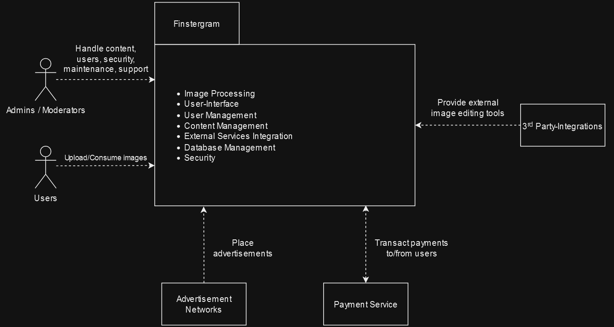

# Architecture Constraints
| Constraints           | Background and/or motivation                                                                            |
|-----------------------|---------------------------------------------------------------------------------------------------------|
| Integration           | Careful coordination is required in order to ensure, that the microservices do not impact each other    |
| Scaling               | Scaling individual microservices accurately can be complex and needs a lot of attention                 |
| Service Communication | Communicating between microservices requires lightweight protocols like REST or gRCP                    |
| Testing               | Testing across multiple microservices poses a challenge in ensuring a complete test coverage            |
| Team Adaption         | A microservices architecture often requires new skills and enhanced teamwork among the development team |

# System Scope and Context
## Business Context Diagram

