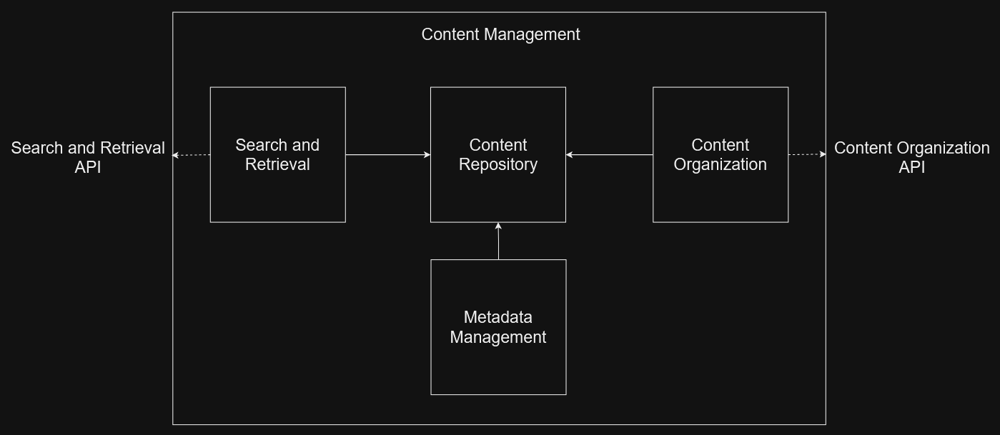

# Building Block View

## Level 1

This building-block-diagram on level 1 provides a structured depiction of the key building blocks and their interrelationships of the system. It offers a high-level overview of the major components within the system.

  
## Level 2 Image Processing

This building-block-diagram on level 2 presents a more detailed perspective of the Image Processing-Component, showcasing their internal structure and relationships.

  
## Level 2 Content Management

This building-block-diagram on level 2 presents a more detailed perspective of the Content Management-Component, showcasing their internal structure and relationships.
