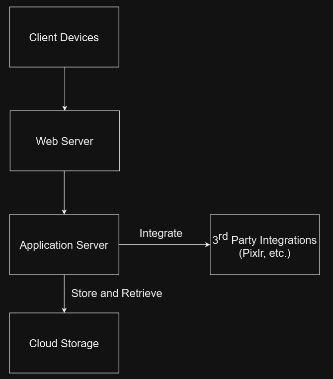

# Deployment View

## CAP

The CAP theorem tells us that a distributed system can only provide two of the three desired properties: Consistency, Availability and Partition Tolerance.
  
Finstergram chooses Availability and Partition Tolerance (AP):
  
Availability (A) is crucial because it ensures that Finstergram is consistently accessible and usable by its users. It guarantees that they can interact with the application whenever they need to without encountering frequent downtime or unavailability. It is essential for maintaining a positive user experience and to meet the stakeholders expectations.
  
Partition Tolerance (P) is important because it gives Finstergram the ability to operate and function effectively despite potential network issues or partitions. It ensures that even if certain parts of the system cannot communicate with each other temporarily because of hardware failures, communication delays, etc., the system as a whole can continue to operate without complete failure.
  
On the other hand, Consistency (C) could guarantee that every user has the same view of the data at the same time. However, strong Consistency has to be sacrificed in favor of Availability and Partition Tolerance. It has to be accepted that various users do not always have immediate access to the latest version of the data.

## Deployment-Diagram

