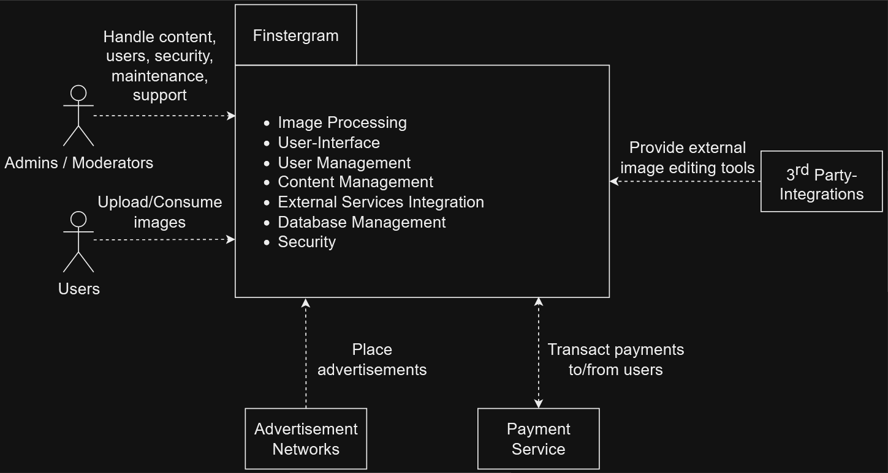
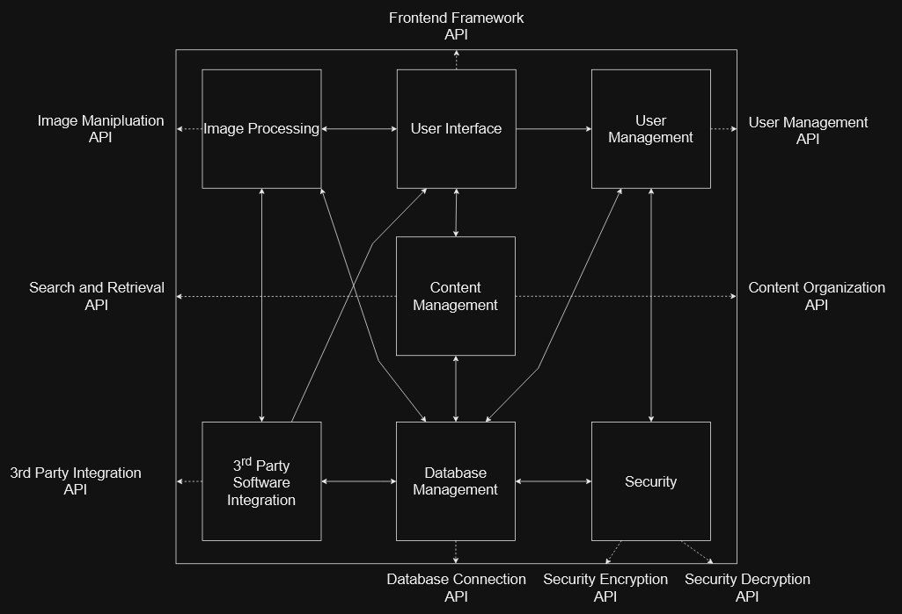
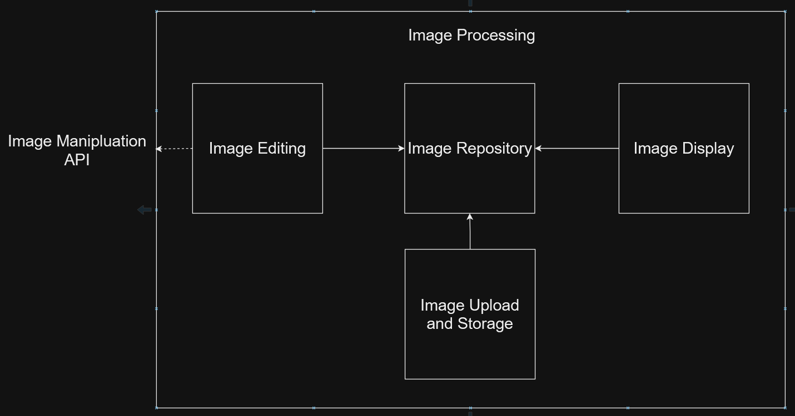
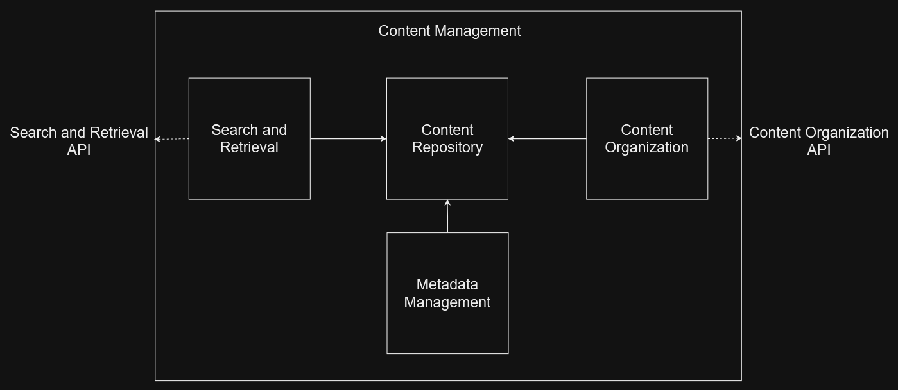
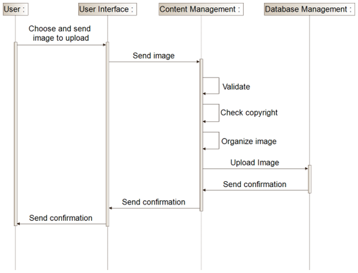
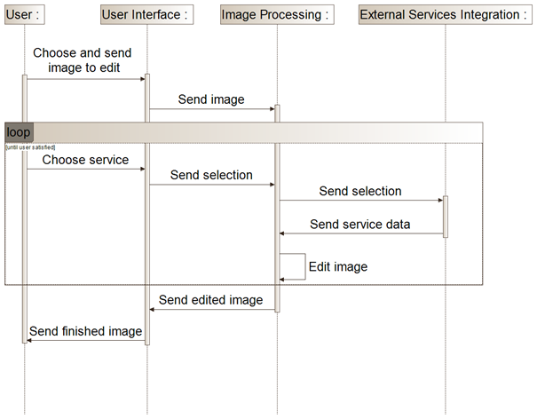
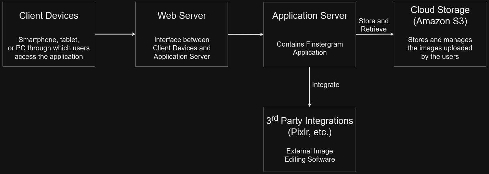
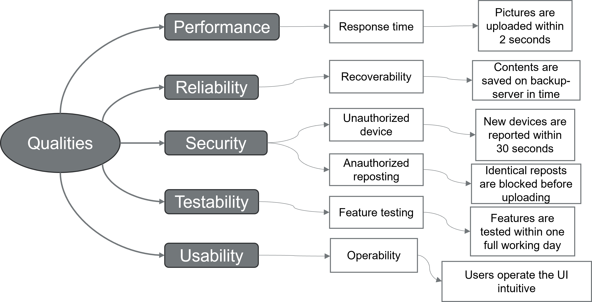

# arc42 of Finstergram - An international image sharing application 

 

## Github-Repository:

https://github.com/RenoKomarek/swarc-material

## Project-Team: 

Reno Komarek,  
Mert Sali,   
Benjamin Bendinger,   
Jan Philip Schreiber

## Business Requirements Document (BRD) of Finstergram

1. Introduction
The purpose of this BRD is to outline the business requirements for an image sharing app targeting photography enthusiasts and professionals. The app will allow users to share and discover high-quality, visually stunning images that are not found on other social media platforms. The app will differentiate itself from competitors by offering advanced editing tools, customizable filters, and a strong community aspect.

2. Scope
The app will be available on both iOS and Android platforms and will be accessible to users globally. The primary target audience is millennials and Gen Zers who are interested in photography and visual storytelling. The app will offer both a free version with limited features and a paid subscription model for access to advanced tools and features.

3. Business Requirements
    * User Profiles
  The app will allow users to create profiles and connect with other users based on shared interests and photography styles. Users will be able to create collections of their favorite images and follow other    users for inspiration and engagement.

    * Image Sharing
  Users will be able to share their images with the community and tag them with relevant keywords for search and discovery. The app will allow for easy sharing of images on other social media platforms such     as Facebook and Instagram.

    * Advanced Editing Tools
  The app will offer a range of advanced editing tools such as color correction, white balance adjustment, exposure adjustment, and cropping. Users will also be able to add text, borders, and other creative     elements to their images.

    * Customizable Filters
  Users will be able to create and save their own custom filters, as well as choose from a range of pre-made filters that cater to various photography styles and aesthetics.

    * Community Features
  The app will have a strong community aspect, with features such as user-generated challenges and competitions, a social feed for following other users' activity, and the ability to leave comments and engage   with other users.

    * Subscription Model
  The app will offer a free version with limited features, as well as a paid subscription model for access to advanced tools and features. Subscription plans will be offered on a monthly or annual basis, with   the ability to cancel at any time.

4. Business Goals
The primary business goals for the app are to attract a large and engaged user base, increase brand awareness and user retention, and generate revenue through the subscription model and potential advertising and sponsored content opportunities.

5. Third-party integration
The third-party service we plan to integrate with is Pixlr, a cloud-based photo editing platform that provides users with a wide range of editing and filtering tools. The integration will allow users to access Pixlr's tools directly within our app, without having to leave the platform.

6. Acceptance Criteria
The app must meet the following acceptance criteria:
    * The app must be user-friendly and easy to navigate
    * The app must be stable and function without significant bugs or errors
    * The app must be optimized for performance and load times
    * The app must offer advanced editing tools and customizable filters
    * The app must have a strong community aspect with engaging features such as challenges and competitions
    * The subscription model must be clearly communicated and easy to understand
    * The app must meet all relevant security and privacy regulations

7. Sign-Off
We, the undersigned stakeholders, have reviewed and approved this Business Requirements Document for the image sharing app. We agree that the requirements outlined in this document are accurate and reflect the goals and objectives of the project.

Signed:
Sarah Chen, Marketing Manager, Bold Branding Agency
Michael Nguyen, Project Manager, Digital Dreams Inc.
Ava Patel, Lead Developer, Pixel Perfect Solutions
Emily Wong, UX/UI Designer, Creative Co.
Samir Singh, User Representative, Photography Enthusiast
Lucas Rodriguez, Photography Expert, Snap & Shoot Magazine

# Introduction and Goals

## Requirements Overview

Finstergram is a image sharing app with focus on professional photography.
The five most important functional requirements are:

-   Image sharing and navigation

-   Image editing and custom filter creation

-   Community challenges, competitions and activities

-   Third-party integration of popular image editing software

-   Paid subscription model

## Quality Goals

The three most important quality goals are:

| Priority | Quality                | Motivation                                                                                                            |
|----------|------------------------|-----------------------------------------------------------------------------------------------------------------------|
| 1        | High resolution images | The quality of the images is important in order to differentiate from the competition and satisfy the target audience |
| 2        | Performance            | Every process executed by the end-user should be fast enough to match the current standard                            |
| 3        | Compatibility          | The application should perform well on every type of device                                                           |

## Stakeholders

The five most important stakeholders of the system are:

| Role/Name     | Contact                 | Expectations                                                      |
|---------------|-------------------------|-------------------------------------------------------------------|
| End-user      | end-user@email.com      | They want a place to share and edit images with likeminded people |
| Influencer    | influencer@email.com    | They want to earn money                                           |
| Administrator | administrator@email.com | They want an easy to maintain, update and administrate system     |
| Investor      | investor@email.com      | They want the platform to make profit                             |
| Product owner | product-owner@email.com | They want the platform to grow and make profit                    |        

# Architecture Constraints

The five most important architectural constraints are:

| Constraints           | Background and/or motivation                                                                            |
|-----------------------|---------------------------------------------------------------------------------------------------------|
| Integration           | Careful coordination is required in order to ensure, that the microservices do not impact each other    |
| Scaling               | Scaling individual microservices accurately can be complex and needs a lot of attention                 |
| Service Communication | Communicating between microservices requires lightweight protocols like REST or gRCP                    |
| Testing               | Testing across multiple microservices poses a challenge in ensuring a complete test coverage            |
| Team Adaption         | A microservices architecture often requires new skills and enhanced teamwork among the development team |

# System Scope and Context
## Business Context Diagram

This business context diagram gives a high level overwiev of the system and shows which data are exchanged with the environment. The primary actors and external systems are visualized here.

# Solution Strategy

The three most important goals and their architectural approaches are:

| Goal/Requirements                               | Architectural Approach                                                                                                                                                 |
|-------------------------------------------------|------------------------------------------------------------------------------------------------------------------------------------------------------------------------|
| Image Editing and Sharing                       | Microservices - Enables the easy addition of new filters and photo functions. Ensures professional image editing capabilities with extensibility.                      |
| Third-party Integration of cloud-based software | Service-Oriented Architecture (SOA) - Seamless integration of a service, developed by the partner.                                                                     |
| User-generated Challenges and Competitions      | Microservices - A central challenge creation service and additional services for challenge validation. Facilitates user-generated challenges, competitions, and feeds. |

# Fundamental Decisions

We have opted to maintain our Microservices architecture. Microservices offer agility and flexibility, allowing us to respond quickly to evolving requirements and reducing the complexity associated with a monolithic architecture.

The three most important fundamental decisions are:

| Problem                                                           | Considered Alternatives                       | Decision                                                                                                |
|-------------------------------------------------------------------|-----------------------------------------------|---------------------------------------------------------------------------------------------------------|
| A microservice is necessary for a new challenge                   | Adapt old microservice for new challenges     | We chose to create a new microservice for every new challenge, to be able to reactivate old challenges. |
| If every filter has its own microservice, they are too dependent  | Do not give every filter its own microservice | Filtering is a single microservice and all filters are saved in a database                              |
| Testing is complex, because every single service has to be tested | With SOA, there would be less testing expense | Because we do not have liquidity problems, we stay with microservices                                   |

# Building Block View

## Level 1

This building-block-diagram on level 1 provides a structured depiction of the key building blocks and their interrelationships of the system. It offers a high-level overview of the major components within the system.

## Level 2 Image Processing

This building-block-diagram on level 2 presents a more detailed perspective of the Image Processing-Component, showcasing their internal structure and relationships.

## Level 2 Content Management

This building-block-diagram on level 2 presents a more detailed perspective of the Content Management-Component, showcasing their internal structure and relationships.

# Runtime View

## Runtime Scenario: Upload Image

This runtime-view-diagram illustrates the dynamic aspects of the Upload Image-Process. It showcases how the components interact and collaborate at runtime. Here a user wants to upload an image to Finstergram.

## Runtime Scenario: Edit Image

This runtime-view-diagram illustrates the dynamic aspects of the Edit Image-Process. It showcases how the components interact and collaborate at runtime. Here a user wants to edit an image using Finstergram.

# Deployment View

## CAP

The CAP theorem tells us that a distributed system can only provide two of the three desired properties: Consistency, Availability and Partition Tolerance.
  
Finstergram chooses Availability and Partition Tolerance (AP):
  
Availability (A) is crucial because it ensures that Finstergram is consistently accessible and usable by its users. It guarantees that they can interact with the application whenever they need to without encountering frequent downtime or unavailability. It is essential for maintaining a positive user experience and to meet the stakeholders expectations.
  
Partition Tolerance (P) is important because it gives Finstergram the ability to operate and function effectively despite potential network issues or partitions. It ensures that even if certain parts of the system cannot communicate with each other temporarily because of hardware failures, communication delays, etc., the system as a whole can continue to operate without complete failure.
  
On the other hand, Consistency (C) could guarantee that every user has the same view of the data at the same time. However, strong Consistency has to be sacrificed in favor of Availability and Partition Tolerance. It has to be accepted that various users do not always have immediate access to the latest version of the data.

## Deployment-Diagram

This deployment-view-diagram describes the technical infrastructure of finstergram. Users communicate via client devices with the internet. A web server hosts the app's interface, while an application server manages its functions. The application server also interfaces with third-party integrations like Pixlr. A Amazon S3 Cloud Storage stores imagse and user data.

# Cross-cutting Concepts

The three most important cross-cutting concepts are:

- Development concept

    Developers should name Variables etc. after a strict concept/pattern/system to ensure consistency across Services

- Organizational concept

    The backup-server runs at reduced speed during maintenance of the main-servers to enusure stability

- Security concept

    Passwords are stored with encryption via a hashcode converting system from an external library to ensure security

                              

# Architecture Decisions

The three most important architectural decisions are:

| Context                                                                                      | Decision                                       | Consequences                                                                                                                                                                  |
|----------------------------------------------------------------------------------------------|------------------------------------------------|-------------------------------------------------------------------------------------------------------------------------------------------------------------------------------|
| We want to manage the code on GitHub and need to decide if, we want one or more repositories | We will only use a single repository           | The whole code is in a single place and one can find it faster. There might be organizational problems.                                                                       |
| We have multiple teams and not everyone can code the same language                           | We will use multiple coding languages          | We have a microservices architecture, which means that every code of a microservice can be written in a different language. Not everybody will be able to work on every code. |
| We have a lot of user passwords and need to store them                                       | We will store passwords in a hash code library | Database performs worse due to computationally intensive process. An extra library has to be implemented. The passwords are more secure.                                      |

# Quality Requirements

## Quality Tree

## Quality Scenarios

Three quality scenarios are:

- Performance
    Scenario: A user wants to upload a picture under normal operations. The picture is uploaded within 2 Seconds.
  
- Recoverability
    Scenario: A user wants to edit a picture and the server closes. All changes are saved in time.

- Security
    Scenario: A user logs in with a different IP-address. The report is sent within 30 seconds.

# Risks and Technical Debts

The three most important risks/technical depts are:

- Data Management
 The influx of inconsistent data poses challenges in terms of organization and distribution. Ensuring the consistency and accuracy of data across the system becomes a complex task. Failure to manage data effectively can lead to data quality issues, potentially impacting decision-making and system performance.

- Security
  Implementing security measures in each Microservice incurs significant costs. Additionally, securing sensitive data across multiple services is both cost and time-intensive.

- Complexity
 The increasing complexity of the architecture demands more resources for inter-service communication and the seamless integration of new services into the existing network. 

# Glossary

| Term                   | Definition                                                                                |
|------------------------|-------------------------------------------------------------------------------------------|
| Finstergram            | The title identifying this image sharing application                                      |
| Github                 | A web-based platform for collaborative software development and version control using Git |
| Image                  | A picture, that the user can edit, upload, and find on Finstergram                        |
| Image sharing          | Sharing images with other users on Finstergram                                            |
| Image upload           | Transferring an image file to a remote server for storage and sharing on Finstergram      |
| Image navigation       | Browsing or moving through images within the user interface on Finstergram                |
| Image editing          | Modifying images to enhance or alter their appearance                                     |
| Filter                 | Visual effects applied to an image to change their appearance                             |
| Image editing software | Applications for modifying and enhancing images                                           |

