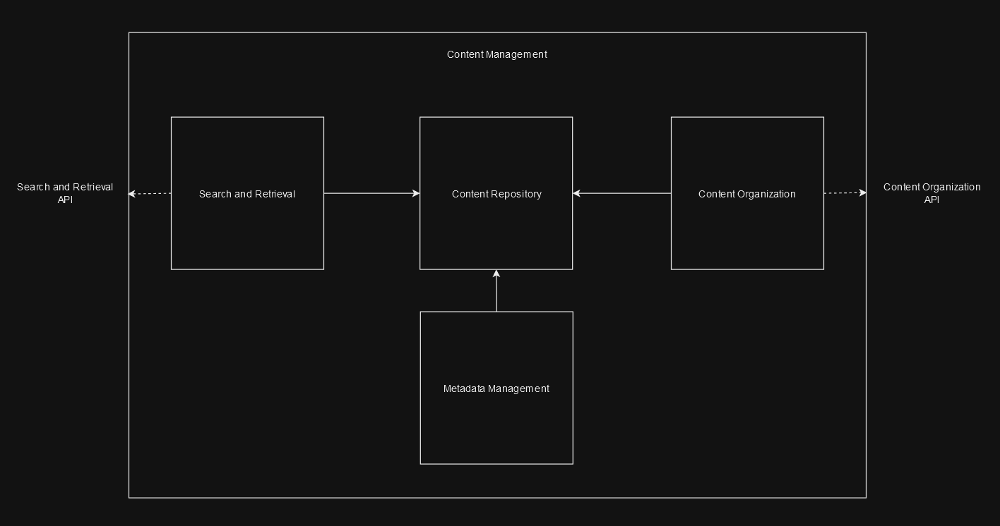
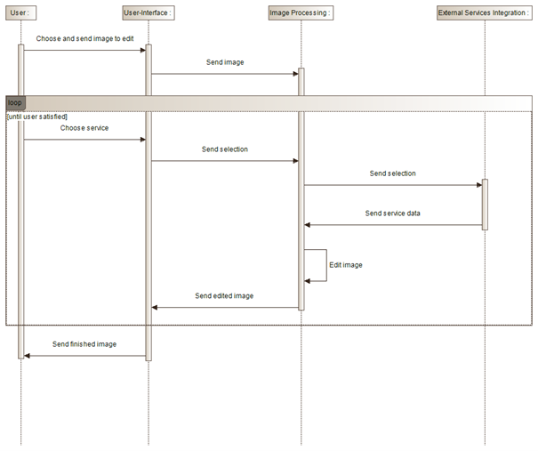

# Introduction and Goals

## Requirements Overview

Finstergram is a image sharing app with focus on professional photography.
The five most important functional requirements are:

-   Image sharing and navigation

-   Image editing and custom filter creation

-   Community challenges, competitions and activities

-   Third-party integration of popular image editing software

-   Paid subscription model

## Quality Goals

The three most important quality goals are:

| Priority | Quality                | Motivation                                                                                                            |
|----------|------------------------|-----------------------------------------------------------------------------------------------------------------------|
| 1        | High resolution images | The quality of the images is important in order to differentiate from the competition and satisfy the target audience |
| 2        | Performance            | Every process executed by the end-user should be fast enough to match the current standard                            |
| 3        | Compatibility          | The application should perform well on every type of device                                                           |

## Stakeholders

The five most important stakeholders of the system are:

| Role/Name     | Contact                 | Expectations                                                      |
|---------------|-------------------------|-------------------------------------------------------------------|
| End-user      | end-user@email.com      | They want a place to share and edit images with likeminded people |
| Influencer    | influencer@email.com    | They want to earn money                                           |
| Administrator | administrator@email.com | They want an easy to maintain, update and administrate system     |
| Investor      | investor@email.com      | They want the platform to make profit                             |
| Product owner | product-owner@email.com | They want the platform to grow and make profit                    |        

# Architecture Constraints
| Constraints           | Background and/or motivation                                                                            |
|-----------------------|---------------------------------------------------------------------------------------------------------|
| Integration           | Careful coordination is required in order to ensure, that the microservices do not impact each other    |
| Scaling               | Scaling individual microservices accurately can be complex and needs a lot of attention                 |
| Service Communication | Communicating between microservices requires lightweight protocols like REST or gRCP                    |
| Testing               | Testing across multiple microservices poses a challenge in ensuring a complete test coverage            |
| Team Adaption         | A microservices architecture often requires new skills and enhanced teamwork among the development team |

# System Scope and Context
## Business Context Diagram

# Solution Strategy

The three most important goals and their architectural approaches are:

| Goal/Requirements                               | Architectural Approach                                                                                                                                                 |
|-------------------------------------------------|------------------------------------------------------------------------------------------------------------------------------------------------------------------------|
| Image Editing and Sharing                       | Microservices - Enables the easy addition of new filters and photo functions. Ensures professional image editing capabilities with extensibility.                      |
| Third-party Integration of cloud-based software | Service-Oriented Architecture (SOA) - Seamless integration of a service, developed by the partner.                                                                     |
| User-generated Challenges and Competitions      | Microservices - A central challenge creation service and additional services for challenge validation. Facilitates user-generated challenges, competitions, and feeds. |

# Fundamental Decisions

We have opted to maintain our Microservices architecture. Microservices offer agility and flexibility, allowing us to respond quickly to evolving requirements and reducing the complexity associated with a monolithic architecture.

The three most important fundamental decisions are:

| Problem                                                           | Considered Alternatives                       | Decision                                                                                                |
|-------------------------------------------------------------------|-----------------------------------------------|---------------------------------------------------------------------------------------------------------|
| A microservice is necessary for a new challenge                   | Adapt old microservice for new challenges     | We chose to create a new microservice for every new challenge, to be able to reactivate old challenges. |
| If every filter has its own microservice, they are too dependent  | Do not give every filter its own microservice | Filtering is a single microservice and all filters are saved in a database                              |
| Testing is complex, because every single service has to be tested | With SOA, there would be less testing expense | Because we do not have liquidity problems, we stay with microservices                                   |

# Building Block View

## Level 1

## Level 2 Image Processing

## Level 2 Content Management

# Runtime View

## Runtime Scenario: Upload Image

## Runtime Scenario: Edit Image

# Deployment View

**Content**

The deployment view describes:

1.  technical infrastructure used to execute your system, with
    infrastructure elements like geographical locations, environments,
    computers, processors, channels and net topologies as well as other
    infrastructure elements and

2.  mapping of (software) building blocks to that infrastructure
    elements.

Often systems are executed in different environments, e.g. development
environment, test environment, production environment. In such cases you
should document all relevant environments.

Especially document a deployment view if your software is executed as
distributed system with more than one computer, processor, server or
container or when you design and construct your own hardware processors
and chips.

From a software perspective it is sufficient to capture only those
elements of an infrastructure that are needed to show a deployment of
your building blocks. Hardware architects can go beyond that and
describe an infrastructure to any level of detail they need to capture.

**Motivation**

Software does not run without hardware. This underlying infrastructure
can and will influence a system and/or some cross-cutting concepts.
Therefore, there is a need to know the infrastructure.

Maybe a highest level deployment diagram is already contained in section
3.2. as technical context with your own infrastructure as ONE black box.
In this section one can zoom into this black box using additional
deployment diagrams:

-   UML offers deployment diagrams to express that view. Use it,
    probably with nested diagrams, when your infrastructure is more
    complex.

-   When your (hardware) stakeholders prefer other kinds of diagrams
    rather than a deployment diagram, let them use any kind that is able
    to show nodes and channels of the infrastructure.

See [Deployment View](https://docs.arc42.org/section-7/) in the arc42
documentation.

## Infrastructure Level 1

Describe (usually in a combination of diagrams, tables, and text):

-   distribution of a system to multiple locations, environments,
    computers, processors, .., as well as physical connections between
    them

-   important justifications or motivations for this deployment
    structure

-   quality and/or performance features of this infrastructure

-   mapping of software artifacts to elements of this infrastructure

For multiple environments or alternative deployments please copy and
adapt this section of arc42 for all relevant environments.

***\<Overview Diagram>***

Motivation  
*\<explanation in text form>*

Quality and/or Performance Features  
*\<explanation in text form>*

Mapping of Building Blocks to Infrastructure  
*\<description of the mapping>*

## Infrastructure Level 2

Here you can include the internal structure of (some) infrastructure
elements from level 1.

Please copy the structure from level 1 for each selected element.

### *\<Infrastructure Element 1>*

*\<diagram + explanation>*

### *\<Infrastructure Element 2>*

*\<diagram + explanation>*

…

### *\<Infrastructure Element n>*

*\<diagram + explanation>*

# Cross-cutting Concepts

The three most important cross-cutting concepts are:

- Development concept

    Developers should name Variables etc. after a strict concept/pattern/system to ensure consistency across Services

- Organizational concept

    The backup-server runs at reduced speed during maintenance of the main-servers to enusure stability

- Security concept

    Passwords are stored with encryption via a hashcode converting system from an external library to ensure security

                              

# Architecture Decisions

The three most important architectural decisions are:

| Context                                                                                      | Decision                                       | Consequences                                                                                                                                                                  |
|----------------------------------------------------------------------------------------------|------------------------------------------------|-------------------------------------------------------------------------------------------------------------------------------------------------------------------------------|
| We want to manage the code on GitHub and need to decide if, we want one or more repositories | We will only use a single repository           | The whole code is in a single place and one can find it faster. There might be organizational problems.                                                                       |
| We have multiple teams and not everyone can code the same language                           | We will use multiple coding languages          | We have a microservices architecture, which means that every code of a microservice can be written in a different language. Not everybody will be able to work on every code. |
| We have a lot of user passwords and need to store them                                       | We will store passwords in a hash code library | Database performs worse due to computationally intensive process. An extra library has to be implemented. The passwords are more secure.                                      |

# Quality Requirements

## Quality Tree

## Quality Scenarios

Three quality scenarios are:

- Performance
    Scenario: A user wants to upload a picture under normal operations. The picture is uploaded within 2 Seconds.
  
- Recoverability
    Scenario: A user wants to edit a picture and the server closes. All changes are saved in time.

- Security
    Scenario: A user logs in with a different IP-address. The report is sent within 30 seconds.

# Risks and Technical Debts

The three most important risks/technical depts are:

- Data Management
 The influx of inconsistent data poses challenges in terms of organization and distribution. Ensuring the consistency and accuracy of data across the system becomes a complex task. Failure to manage data effectively can lead to data quality issues, potentially impacting decision-making and system performance.

- Security
  Implementing security measures in each Microservice incurs significant costs. Additionally, securing sensitive data across multiple services is both cost and time-intensive.

- Complexity
 The increasing complexity of the architecture demands more resources for inter-service communication and the seamless integration of new services into the existing network. 

# Glossary

**Contents**

The most important domain and technical terms that your stakeholders use
when discussing the system.

You can also see the glossary as source for translations if you work in
multi-language teams.

**Motivation**

You should clearly define your terms, so that all stakeholders

-   have an identical understanding of these terms

-   do not use synonyms and homonyms

A table with columns \<Term> and \<Definition>.

Potentially more columns in case you need translations.

See [Glossary](https://docs.arc42.org/section-12/) in the arc42
documentation.

| Term        | Definition        |
|-------------|-------------------|
| *\<Term-1>* | *\<definition-1>* |
| *\<Term-2>* | *\<definition-2>* |
